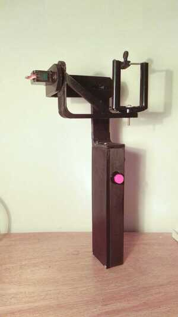

# Sistema estabilizador de dois eixos para câmera - Gimbal

Foto do dispositivo montado sem o celular no suporte.

Renderização de modelo montado em computador, mostrando a placa de circuitos e as baterias internas.

## O que é?
É um dispositivo que procura manter a orientação de uma câmera ou celular fixa, compensando possíveis variações que podem ocorrer durante a gravação de um vídeo ou fotografia. O sistema estabiliza nos eixos X e Y conforme a figura:

## Como funciona?
O sistema contrói uma representação interna da orientação do dispositivo em relação à direção da gravidade com base nas leituras de dois sensores giroscópio e acelerômetro. Então utilizando de dois motores atuando sobre a orientação da câmera a gravação é estabilizada.

## Casos de uso
Além de servir como estabilizador para câmeras, esse sistema pode ser readequado para uso em robôs sensíveis à orientação, drones ou em aplicações de realidade virtual capturando a orientação de um objeto no mundo real.

## Mais detalhes
Para mais detalhes e referências sobre o projeto, verifique o [relatório final nesse mesmo repositório](https://github.com/ratatusznei/gimbal-EEX21/blob/master/relatorio/pdfs/EEX21_Equipe5_Relatorio_EstabilizadorDeDoisEixosPraCameras.pdf).
